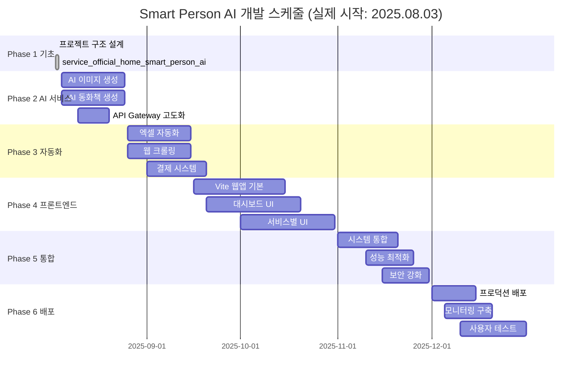

# Smart Person AI 개발 스케줄

## 🎯 프로젝트 개요
- **프로젝트명**: 현사AI (Smart Person AI)
- **개발 시작**: 2025.08.03 (어제)
- **오늘**: 2025.08.04
- **예상 완료**: 2025.12.31 (5개월)
- **아키텍처**: Domain-driven Microservices Architecture (MSA)
- **목표**: AI를 모르는 사람들을 위한 AI 산출물 공급 서비스

---

## 📅 전체 로드맵 (6 Phase)



---

## ✅ Phase 1: 기초 설계 & 홈페이지 (진행 중)
**기간**: 2025.08.03 ~ 2025.08.04 (2일간)

### 완성된 기능 (어제~오늘)
- [x] **프로젝트 기획** (2025.08.03): 비즈니스 모델 및 기술 스택 결정
- [x] **MSA 아키텍처 설계** (2025.08.03): 6개 마이크로서비스 구조 확정
- [x] **service_official_home_smart_person_ai** (2025.08.04): Next.js + FastAPI 홈페이지 완성
  - SEO 최적화 랜딩 페이지 (6개 섹션)
  - 백엔드 API (문의, 뉴스레터, 데모)
  - Docker 컨테이너화
- [x] **프로젝트 구조** (2025.08.04): 전체 폴더 구조 및 설정 파일
- [x] **개발 환경** (2025.08.04): Docker Compose, Nginx 설정
- [x] **기술 문서** (2025.08.04): 상세 아키텍처 및 개발 가이드 (4개 문서)

### 실제 성과 지표 (48시간 내 달성)
- ✅ 홈페이지 완성도: 100% (6개 섹션 모두 구현)
- ✅ SEO 준비도: 100% (메타데이터, 구조화 데이터)
- ✅ 문서화: 4개 상세 문서 작성
- ✅ 프론트엔드 기술 결정: Vite vs Next.js 이슈 해결
- ✅ 개발 속도: 2일만에 완전한 홈페이지 구축 (매우 빠른 진행)

---

## 🚀 Phase 2: 핵심 AI 서비스 구현 (다음 단계)
**기간**: 2025.08.05 ~ 2025.08.25 (3주)

**시작 예정**: 내일 (2025.08.05)부터

### 🎨 AI 이미지 생성 서비스 (Week 1-2)
```python
# service_ai_content_image/main.py 고도화
POST /api/v1/image/generate          # 이미지 생성
POST /api/v1/image/style-transfer    # 스타일 변환
GET  /api/v1/image/templates         # 템플릿 목록
POST /api/v1/image/batch             # 배치 생성
```

**주요 작업**:
- [ ] **Stable Diffusion API 통합**
  - Hugging Face Diffusers 라이브러리 통합
  - 다양한 모델 지원 (SD 1.5, SDXL, etc.)
  - 프롬프트 최적화 알고리즘
- [ ] **이미지 처리 파이프라인**
  - 업스케일링 (Real-ESRGAN)
  - 후처리 (색상 보정, 필터)
  - 워터마크 자동 삽입
- [ ] **템플릿 시스템**
  - 카테고리별 프롬프트 템플릿
  - 사용자 맞춤 스타일 저장
  - 인기 템플릿 추천

### 📚 AI 동화책 생성 서비스 (Week 2-3)
```python
# service_ai_content_book/main.py 고도화
POST /api/v1/book/generate           # 동화책 생성
POST /api/v1/book/chapter            # 챕터별 생성
GET  /api/v1/book/themes             # 테마 목록
POST /api/v1/book/illustration       # 일러스트 생성
```

**주요 작업**:
- [ ] **Claude API 통합**
  - Claude Sonnet 4 API 연동
  - 연령별 콘텐츠 생성 로직
  - 교육적 가치 검증 시스템
- [ ] **스토리텔링 엔진**
  - 캐릭터 일관성 유지
  - 플롯 구조 자동 생성
  - 도덕적 메시지 삽입
- [ ] **일러스트 연동**
  - 스토리 내용 기반 이미지 생성
  - 캐릭터 일관성 유지
  - 페이지 레이아웃 자동화

### 🌐 API Gateway 고도화 (Week 3-4)
```python
# service_api_gateway/main.py 확장
# 인증/인가 시스템
POST /api/v1/auth/register           # 회원가입
POST /api/v1/auth/login              # 로그인
POST /api/v1/auth/refresh            # 토큰 갱신

# 사용량 관리
GET  /api/v1/usage/current           # 현재 사용량
GET  /api/v1/usage/history           # 사용 히스토리
POST /api/v1/usage/quota             # 할당량 설정
```

**주요 작업**:
- [ ] **인증 시스템**
  - JWT 토큰 기반 인증
  - OAuth 2.0 (Google, Kakao)
  - 세션 관리 및 보안
- [ ] **API 게이트웨이 기능**
  - 요청 라우팅 및 로드밸런싱
  - Rate Limiting
  - API 키 관리
- [ ] **토큰 사용량 추적**
  - 실시간 사용량 모니터링
  - 구독 플랜별 제한
  - 자동 차단 및 알림

### 📊 예상 성과 (Phase 2 완료 시)
- AI 이미지: 시간당 100개 생성 가능
- AI 동화책: 시간당 20편 생성 가능
- API 처리량: 초당 1000 요청 처리
- 사용자 등록: 베타 사용자 100명 목표

---

## 🤖 Phase 3: 자동화 서비스 구현
**기간**: 2025.01.16 ~ 2025.02.15 (4주)

### 📊 엑셀 자동화 서비스 (Week 1-2)
```python
# service_automation_excel_service/main.py 확장
POST /api/v1/excel/merge             # 파일 병합
POST /api/v1/excel/analyze           # 데이터 분석
POST /api/v1/excel/chart             # 차트 생성
POST /api/v1/excel/template          # 템플릿 적용
```

**주요 작업**:
- [ ] **pk_system 통합**
  - 기존 엑셀 자동화 함수 포팅
  - API 래퍼 개발
  - 에러 처리 및 로깅
- [ ] **고급 기능 구현**
  - 피벗 테이블 자동 생성
  - 조건부 서식 적용
  - 매크로 자동 실행
- [ ] **배치 처리**
  - 대용량 파일 처리
  - 백그라운드 작업 큐
  - 진행 상황 실시간 알림

### 🕷️ 웹 크롤링 서비스 (Week 2-3)
```python
# service_automation_web_crawler/main.py 확장
POST /api/v1/crawler/stock           # 주가 크롤링
POST /api/v1/crawler/news            # 뉴스 크롤링
GET  /api/v1/crawler/schedule        # 스케줄 조회
POST /api/v1/crawler/custom          # 커스텀 크롤링
```

**주요 작업**:
- [ ] **데이터 소스 통합**
  - 한국 주식 (KRX, 네이버 금융)
  - 미국 주식 (Yahoo Finance, Bloomberg)
  - 뉴스 사이트 (연합뉴스, 조선일보 등)
- [ ] **데이터 정제**
  - 중복 제거 알고리즘
  - 감정 분석 (긍정/부정/중립)
  - 키워드 추출 및 카테고리 분류
- [ ] **실시간 모니터링**
  - 스케줄러 (Celery + Redis)
  - 알림 시스템 (이메일, 슬랙)
  - 데이터 품질 검증

### 💳 결제 시스템 구현 (Week 3-4)
```python
# service_payment/main.py 확장
POST /api/v1/payment/prepare         # 결제 준비
POST /api/v1/payment/approve         # 결제 승인
POST /api/v1/payment/cancel          # 결제 취소
GET  /api/v1/payment/history         # 결제 내역
```

**주요 작업**:
- [ ] **PG사 연동**
  - 토스페이먼츠 API 통합
  - 결제 방식: 카드, 계좌이체, 간편결제
  - 정기 결제 (구독) 시스템
- [ ] **구독 관리**
  - 플랜별 기능 제한
  - 자동 갱신 및 해지
  - 프로레이션 (일할 계산)
- [ ] **매출 관리**
  - 실시간 매출 대시보드
  - 환불 처리 자동화
  - 세금계산서 발행

### 📊 예상 성과 (Phase 3 완료 시)
- 엑셀 처리: 시간당 1000개 파일 처리
- 크롤링: 일일 10만 건 데이터 수집
- 결제 시스템: 월 1000건 결제 처리 가능
- 구독자: 50명 유료 구독자 목표

---

## 🎨 Phase 4: 웹앱 프론트엔드 구현
**기간**: 2025.02.16 ~ 2025.03.31 (6주)

### ⚡ Vite 웹앱 기본 구조 (Week 1-2)
```typescript
// 프로젝트 구조
src/
├── components/           # 재사용 컴포넌트
├── pages/               # 페이지 컴포넌트
├── hooks/               # 커스텀 훅
├── stores/              # Zustand 상태 관리
├── services/            # API 호출 함수
└── utils/               # 유틸리티 함수
```

**주요 작업**:
- [ ] **프로젝트 셋업**
  - Vite + React + TypeScript
  - Tailwind CSS + DaisyUI
  - React Query + Zustand
- [ ] **라우팅 시스템**
  - React Router v6
  - 인증 라우트 가드
  - 레이지 로딩
- [ ] **공통 컴포넌트**
  - Design System 구축
  - 재사용 가능한 UI 컴포넌트
  - 반응형 레이아웃

### 📊 대시보드 UI 구현 (Week 2-4)
```typescript
// 주요 페이지들
pages/
├── Dashboard.tsx        # 메인 대시보드
├── Profile.tsx          # 사용자 프로필
├── Usage.tsx            # 사용량 현황
├── Billing.tsx          # 결제 및 구독
└── Settings.tsx         # 설정
```

**주요 작업**:
- [ ] **메인 대시보드**
  - 사용량 현황 차트
  - 최근 생성 콘텐츠
  - 빠른 액션 버튼
- [ ] **사용자 관리**
  - 프로필 편집
  - 비밀번호 변경
  - 계정 설정
- [ ] **결제 관리**
  - 구독 플랜 변경
  - 결제 내역 조회
  - 영수증 다운로드

### 🎨 서비스별 UI 구현 (Week 4-6)
```typescript
// 서비스별 페이지
pages/services/
├── AIImage/            # AI 이미지 생성
├── AIBook/             # AI 동화책 생성
├── ExcelAuto/          # 엑셀 자동화
└── WebCrawler/         # 웹 크롤링
```

**주요 작업**:
- [ ] **AI 이미지 생성**
  - 프롬프트 입력 인터페이스
  - 실시간 생성 진행률
  - 갤러리 및 다운로드
- [ ] **AI 동화책 생성**
  - 테마 선택 위저드
  - 챕터별 편집 기능
  - PDF 내보내기
- [ ] **엑셀 자동화**
  - 파일 업로드 드래그앤드롭
  - 배치 작업 관리
  - 결과 미리보기
- [ ] **웹 크롤링**
  - 크롤링 설정 UI
  - 데이터 시각화
  - 스케줄 관리

### 📊 예상 성과 (Phase 4 완료 시)
- UI/UX 완성도: 90% (모든 주요 기능 구현)
- 모바일 반응형: 100% (모든 화면 대응)
- 사용자 테스트: 20명 베타 테스터 참여
- 피드백 수집: 100개 이상 개선 사항

---

## 🔧 Phase 5: 시스템 통합 & 최적화
**기간**: 2025.04.01 ~ 2025.05.20 (7주)

### 🔄 시스템 통합 테스트 (Week 1-3)
**주요 작업**:
- [ ] **End-to-End 테스트**
  - 사용자 시나리오 기반 자동화 테스트
  - 크로스 브라우저 테스트
  - 모바일 디바이스 테스트
- [ ] **API 통합 테스트**
  - 마이크로서비스 간 통신 검증
  - 에러 처리 및 복구 테스트
  - 부하 테스트 (K6, JMeter)
- [ ] **데이터 일관성 검증**
  - 데이터베이스 무결성 확인
  - 백업/복구 절차 검증
  - 마이그레이션 스크립트 테스트

### ⚡ 성능 최적화 (Week 3-5)
**주요 작업**:
- [ ] **백엔드 최적화**
  - 데이터베이스 인덱스 최적화
  - API 응답 시간 개선 (목표: 평균 200ms 이하)
  - 캐싱 전략 구현 (Redis)
- [ ] **프론트엔드 최적화**
  - 번들 크기 최적화 (목표: 초기 로딩 1MB 이하)
  - 이미지 최적화 (WebP, 지연 로딩)
  - 코드 스플리팅 및 프리로딩
- [ ] **인프라 최적화**
  - CDN 설정 (CloudFlare)
  - 로드밸런서 설정
  - 오토스케일링 구성

### 🔒 보안 강화 (Week 4-6)
**주요 작업**:
- [ ] **보안 감사**
  - OWASP Top 10 취약점 점검
  - SQL Injection 방지
  - XSS/CSRF 보호
- [ ] **인증/인가 강화**
  - 2FA (Two-Factor Authentication)
  - 비밀번호 정책 강화
  - 세션 타임아웃 설정
- [ ] **데이터 보호**
  - 개인정보 암호화
  - HTTPS 강제 적용
  - 데이터 마스킹

### 📊 모니터링 시스템 구축 (Week 5-7)
**주요 작업**:
- [ ] **시스템 모니터링**
  - Prometheus + Grafana 구축
  - 주요 지표 대시보드
  - 알람 시스템 (PagerDuty, Slack)
- [ ] **애플리케이션 모니터링**
  - 로그 수집 (ELK Stack)
  - 에러 추적 (Sentry)
  - 성능 모니터링 (APM)
- [ ] **비즈니스 메트릭**
  - 실시간 사용자 수
  - 서비스별 사용량
  - 매출 대시보드

### 📊 예상 성과 (Phase 5 완료 시)
- API 응답 시간: 평균 150ms (목표 달성)
- 프론트엔드 로딩: 초기 로딩 800KB (목표 달성)
- 보안 점수: 95점 이상 (보안 감사 통과)
- 시스템 가용성: 99.5% 달성

---

## 🚀 Phase 6: 프로덕션 배포 & 운영
**기간**: 2025.05.21 ~ 2025.08.15 (12주)

### 🌐 프로덕션 배포 (Week 1-6)
**주요 작업**:
- [ ] **인프라 구축**
  - AWS 프로덕션 환경 설정
  - Kubernetes 클러스터 구축
  - CI/CD 파이프라인 (GitHub Actions)
- [ ] **도메인 및 SSL**
  - smartpersonai.com 도메인 설정
  - SSL 인증서 적용
  - CDN 설정 (CloudFront)
- [ ] **데이터베이스 설정**
  - RDS PostgreSQL 클러스터
  - Redis 클러스터 (ElastiCache)
  - 백업 자동화

### 📊 운영 시스템 구축 (Week 4-8)
**주요 작업**:
- [ ] **고객 지원 시스템**
  - 티켓팅 시스템 (Zendesk)
  - FAQ 자동 응답
  - 라이브 채팅 시스템
- [ ] **마케팅 도구**
  - Google Analytics 4 설정
  - SEO 최적화 완료
  - 소셜 미디어 연동
- [ ] **법적 준비**
  - 이용약관 및 개인정보처리방침
  - 사업자등록 및 통신판매업 신고
  - 부가세 과세 체계 구축

### 👥 사용자 테스트 및 피드백 (Week 6-12)
**주요 작업**:
- [ ] **베타 테스트**
  - 100명 베타 사용자 모집
  - 피드백 수집 및 분석
  - 주요 버그 수정
- [ ] **소프트 런칭**
  - 제한적 서비스 오픈
  - 실사용자 데이터 수집
  - 성능 모니터링
- [ ] **공식 런칭**
  - 마케팅 캠페인 실행
  - 언론 보도자료 배포
  - 런칭 이벤트

### 📈 초기 운영 및 최적화 (Week 8-12)
**주요 작업**:
- [ ] **사용자 확보**
  - 목표: 1000명 가입자
  - 목표: 100명 유료 사용자
  - 목표: 월 매출 100만원
- [ ] **서비스 개선**
  - 사용자 피드백 기반 개선
  - 새로운 기능 추가
  - 성능 최적화
- [ ] **비즈니스 확장**
  - 추가 AI 모델 도입
  - 파트너십 구축
  - 글로벌 진출 준비

### 📊 예상 성과 (Phase 6 완료 시)
- **사용자 지표**
  - 월 활성 사용자: 1,000명
  - 유료 구독자: 100명 (전환율 10%)
  - 고객 만족도: 4.2/5.0 이상
- **비즈니스 지표**
  - 월 매출: 150만원
  - 고객 획득 비용: 10,000원
  - 고객 생애 가치: 50,000원
- **기술 지표**
  - 시스템 가용성: 99.9%
  - API 응답 시간: 평균 120ms
  - 동시 접속자: 500명 처리 가능

---

## 📊 전체 프로젝트 성공 지표

### 🎯 비즈니스 KPI
| 지표 | 목표 | 달성 시기 |
|------|------|-----------|
| 가입자 수 | 1,000명 | 2025.08 |
| 유료 구독자 | 100명 | 2025.08 |
| 월 매출 | 150만원 | 2025.08 |
| 고객 만족도 | 4.2/5.0 | 2025.08 |
| 브랜드 인지도 | 검색 순위 상위 10위 | 2025.12 |

### ⚡ 기술 KPI
| 지표 | 목표 | 달성 시기 |
|------|------|-----------|
| API 응답 시간 | 평균 120ms | 2025.05 |
| 시스템 가용성 | 99.9% | 2025.06 |
| 프론트엔드 로딩 | 800KB 이하 | 2025.04 |
| 보안 점수 | 95점 이상 | 2025.05 |
| 테스트 커버리지 | 80% 이상 | 2025.04 |

### 🚀 서비스 KPI
| 서비스 | 목표 성능 | 달성 시기 |
|--------|-----------|-----------|
| AI 이미지 생성 | 시간당 500개 | 2025.02 |
| AI 동화책 생성 | 시간당 100편 | 2025.02 |
| 엑셀 자동화 | 시간당 2000개 파일 | 2025.03 |
| 웹 크롤링 | 일일 50만 건 | 2025.03 |

---

## 🔄 위험 요소 및 대응 방안

### ⚠️ 기술적 위험
| 위험 요소 | 확률 | 영향도 | 대응 방안 |
|-----------|------|--------|-----------|
| AI API 장애 | 중간 | 높음 | 복수 API 제공업체 계약, 폴백 시스템 |
| 성능 병목 | 높음 | 중간 | 로드 테스트, 오토스케일링 |
| 보안 취약점 | 낮음 | 높음 | 정기 보안 감사, 버그바운티 |
| 데이터 손실 | 낮음 | 높음 | 실시간 백업, 다중화 |

### 💼 비즈니스 위험
| 위험 요소 | 확률 | 영향도 | 대응 방안 |
|-----------|------|--------|-----------|
| 경쟁사 등장 | 높음 | 중간 | 차별화 기능 강화, 고객 록인 |
| 법적 이슈 | 중간 | 높음 | 법무팀 자문, 컴플라이언스 |
| 자금 부족 | 중간 | 높음 | 단계별 투자 유치, MVP 우선 |
| 시장 변화 | 중간 | 중간 | 시장 조사, 피벗 계획 |

---

## 📋 체크리스트

### ✅ Phase 완료 기준
각 Phase 완료 시 다음 항목들을 체크해야 합니다:

#### Phase 2 완료 기준
- [ ] AI 이미지 생성 API 정상 동작 (테스트 통과)
- [ ] AI 동화책 생성 API 정상 동작 (테스트 통과)
- [ ] API Gateway 인증 시스템 구현
- [ ] 성능 테스트 통과 (목표 TPS 달성)
- [ ] 문서 업데이트 (API 문서, 사용자 가이드)

#### Phase 3 완료 기준
- [ ] 엑셀 자동화 기능 구현 및 테스트
- [ ] 웹 크롤링 시스템 구현 및 테스트
- [ ] 결제 시스템 구현 및 테스트 결제
- [ ] 보안 검토 완료
- [ ] 부하 테스트 통과

#### Phase 4 완료 기준
- [ ] 모든 주요 페이지 구현 완료
- [ ] 크로스 브라우저 테스트 통과
- [ ] 모바일 반응형 확인
- [ ] 접근성(a11y) 기준 준수
- [ ] 사용자 테스트 피드백 반영

#### Phase 5 완료 기준
- [ ] 전체 시스템 통합 테스트 통과
- [ ] 성능 목표 달성 (응답시간, 처리량)
- [ ] 보안 감사 통과
- [ ] 모니터링 시스템 정상 동작
- [ ] 백업/복구 절차 검증

#### Phase 6 완료 기준
- [ ] 프로덕션 환경 정상 배포
- [ ] 사용자 목표 달성 (1000명 가입)
- [ ] 매출 목표 달성 (월 150만원)
- [ ] 고객 만족도 목표 달성 (4.2/5.0)
- [ ] 운영 프로세스 확립

---

## 🎯 결론

현사AI 프로젝트는 **5개월간 6개 Phase**를 통해 완전한 MSA 기반 AI 서비스로 성장할 계획입니다.

### 핵심 성공 요인
1. **단계별 구현**: 각 Phase별 명확한 목표와 성과 지표
2. **기술적 완성도**: MSA 아키텍처 + 현대적 기술 스택
3. **비즈니스 가치**: 실사용자 확보 + 수익 창출
4. **지속 가능성**: 확장 가능한 구조 + 운영 체계

### 2025년 12월 최종 목표
- 📈 **월 매출 150만원** 달성
- 👥 **1,000명 사용자** 확보
- 🏆 **AI 서비스 브랜드** 확립
- 🚀 **글로벌 진출** 기반 마련

**현사AI가 AI 시대의 대표 서비스로 자리매김할 수 있도록 체계적이고 현실적인 로드맵을 따라 개발을 진행합니다!** 🎯