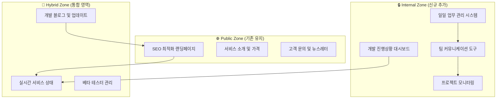

# Service Official Home 기능 재정의 분석서

## 📋 업무제안서 분석 결과

### 🔍 핵심 발견사항
방금 작성한 `TBD_TBD_TBD_TBD_TBD_TBD_daily.md` 업무제안서를 분석한 결과, **service_official_home_smart_person_ai**이 단순한 마케팅 홈페이지를 넘어서 **개발 프로젝트 관리 허브**로 확장되어야 한다는 필요성을 발견했습니다.

### 📊 업무제안서 주요 요구사항 분석

#### 1. **일일 진행상황 관리 필요성**
```
- 매일 오전 9시 진행상황 보고
- 전일 완료 작업, 당일 계획, 이슈 사항 추적
- 실시간 개발 상태 모니터링
```

#### 2. **개발팀 커뮤니케이션 도구 필요**
```
- Phase별 업무 진행 상황 공유
- 기술적 이슈 및 해결방안 논의
- 코드 리뷰 및 피드백 시스템
```

#### 3. **프로젝트 관리 대시보드 필요**
```
- 3주간 Phase 2 진행률 추적
- KPI 달성 현황 모니터링
- 위험 요소 알림 시스템
```

---

## 🔄 Service Official Home 기능 재정의

### 🎯 새로운 비전
**"현사AI의 통합 프로젝트 관리 및 대외 소통 플랫폼"**

기존의 단순한 마케팅 홈페이지에서 **개발팀 협업 도구**와 **고객 소통 플랫폼**이 통합된 **하이브리드 서비스**로 진화

### 🏗️ 재정의된 아키텍처



---

## 🆕 추가될 핵심 기능들

### 1. 📊 **개발 대시보드 (Development Dashboard)**

#### Frontend 컴포넌트
```typescript
// components/internal/DevelopmentDashboard.tsx
const DevelopmentDashboard = () => {
  return (
    <div className="dashboard-grid">
      {/* Phase 진행률 */}
      <PhaseProgressCard 
        phase="Phase 2"
        progress={15}  // 3주 중 현재 진행률
        startDate="2025.08.05"
        endDate="2025.08.25"
      />
      
      {/* 일일 목표 달성률 */}
      <DailyTargetCard 
        today="2025.08.05"
        completed={2}
        total={8}
        tasks={todayTasks}
      />
      
      {/* KPI 모니터링 */}
      <KPIMonitorCard 
        metrics={{
          "API 응답시간": "250ms",
          "이미지 생성 속도": "45초/개",
          "시스템 가용성": "99.2%"
        }}
      />
      
      {/* 위험 요소 알림 */}
      <RiskAlertCard 
        risks={[
          { type: "성능", level: "주의", message: "GPU 사용률 85%" },
          { type: "일정", level: "보통", message: "AI API 응답 지연" }
        ]}
      />
    </div>
  );
};
```

#### Backend API 확장
```python
# backend/main.py 확장
@app.get("/api/v1/internal/dashboard")
async def get_dashboard_data():
    """개발 대시보드 데이터"""
    return {
        "phase_progress": calculate_phase_progress(),
        "daily_tasks": get_daily_tasks(),
        "kpi_metrics": get_realtime_kpi(),
        "risk_alerts": check_risk_factors(),
        "team_status": get_team_availability()
    }

@app.post("/api/v1/internal/daily-report")
async def submit_daily_report(report: DailyReport):
    """일일 진행상황 보고"""
    # 전일 완료 작업
    # 당일 계획
    # 이슈 사항
    return {"status": "submitted", "report_id": uuid4()}
```

### 2. 📝 **일일 업무 관리 시스템**

#### 컴포넌트 구조
```typescript
// components/internal/DailyTaskManager.tsx
const DailyTaskManager = () => {
  const [tasks, setTasks] = useState<Task[]>([]);
  
  return (
    <div className="task-manager">
      {/* 오늘의 업무 */}
      <TodayTasksSection 
        date="2025.08.05"
        tasks={tasks.filter(t => t.date === today)}
      />
      
      {/* 업무 진행 상황 */}
      <TaskProgressSection 
        inProgress={tasks.filter(t => t.status === 'in_progress')}
        completed={tasks.filter(t => t.status === 'completed')}
      />
      
      {/* 이슈 및 블로커 */}
      <IssueTrackingSection 
        blockers={getBlockers()}
        risks={getRisks()}
      />
      
      {/* 다음 단계 계획 */}
      <NextStepsSection 
        tomorrow={getTomorrowTasks()}
        thisWeek={getWeeklyGoals()}
      />
    </div>
  );
};
```

### 3. 💬 **팀 커뮤니케이션 도구**

#### 실시간 채팅 및 업데이트
```typescript
// components/internal/TeamCommunication.tsx
const TeamCommunication = () => {
  return (
    <div className="communication-hub">
      {/* 실시간 활동 피드 */}
      <ActivityFeed 
        activities={[
          { type: "commit", user: "AI Assistant", message: "AI 이미지 서비스 기본 구조 완성" },
          { type: "issue", user: "Developer", message: "GPU 메모리 부족 이슈 발생" },
          { type: "milestone", message: "Phase 2 Week 1 시작" }
        ]}
      />
      
      {/* 코드 리뷰 요청 */}
      <CodeReviewSection 
        pendingReviews={getPendingReviews()}
      />
      
      {/* 기술 논의 */}
      <TechnicalDiscussion 
        topics={getCurrentDiscussions()}
      />
    </div>
  );
};
```

### 4. 📈 **프로젝트 모니터링**

#### 실시간 메트릭 추적
```python
# backend/monitoring.py
class ProjectMonitor:
    def __init__(self):
        self.metrics_collector = MetricsCollector()
        self.alert_system = AlertSystem()
    
    async def collect_metrics(self):
        """실시간 프로젝트 메트릭 수집"""
        return {
            "development_velocity": self.calculate_velocity(),
            "code_quality": self.assess_code_quality(),
            "test_coverage": self.get_test_coverage(),
            "deployment_status": self.check_deployment_health(),
            "user_feedback": self.aggregate_feedback()
        }
    
    async def check_alerts(self):
        """프로젝트 위험 요소 체크"""
        alerts = []
        
        if self.metrics_collector.get_velocity() < 0.7:
            alerts.append({
                "type": "velocity",
                "level": "warning",
                "message": "개발 속도가 목표보다 30% 느립니다"
            })
        
        return alerts
```

---

## 🔄 기존 기능과의 통합 방안

### 🌐 **Public Zone (기존 유지 + 개선)**
```python
# 기존 홈페이지 기능 유지하면서 확장
@app.get("/")
async def home_page():
    """공개 홈페이지 (기존 유지)"""
    return render_template("home.html")

@app.get("/development-blog")
async def development_blog():
    """개발 진행상황 공개 블로그 (신규)"""
    # 내부 개발 현황을 일반인도 이해할 수 있게 가공
    return render_blog_posts()

@app.get("/beta-status")
async def beta_status():
    """베타 서비스 현황 (신규)"""
    return {
        "phase": "Phase 2",
        "features_ready": ["홈페이지", "기본 구조"],
        "coming_soon": ["AI 이미지", "AI 동화책"],
        "beta_signup": "/beta/signup"
    }
```

### 🔒 **Internal Zone (완전 신규)**
```python
# 개발팀 전용 기능
@app.middleware("http")
async def internal_auth_middleware(request: Request, call_next):
    """내부 개발자 인증"""
    if request.url.path.startswith("/internal"):
        # JWT 토큰 검증 또는 개발자 인증
        token = request.headers.get("Authorization")
        if not verify_developer_token(token):
            raise HTTPException(401, "Developer access required")
    
    return await call_next(request)

@app.get("/internal/dashboard")
async def internal_dashboard():
    """개발팀 전용 대시보드"""
    return render_template("internal/dashboard.html")
```

---

## 📁 새로운 폴더 구조

```
service_official_home_smart_person_ai/
├── frontend/
│   ├── components/
│   │   ├── public/              # 기존 공개 컴포넌트
│   │   │   ├── HeroSection.tsx
│   │   │   ├── ServicesSection.tsx
│   │   │   └── ...
│   │   ├── internal/            # 신규 내부 컴포넌트
│   │   │   ├── DevelopmentDashboard.tsx
│   │   │   ├── DailyTaskManager.tsx
│   │   │   ├── TeamCommunication.tsx
│   │   │   └── ProjectMonitoring.tsx
│   │   └── hybrid/              # 공개/내부 통합 컴포넌트
│   │       ├── DevelopmentBlog.tsx
│   │       ├── BetaStatus.tsx
│   │       └── ServiceHealth.tsx
│   ├── pages/
│   │   ├── page.tsx             # 기존 공개 홈페이지
│   │   ├── internal/            # 내부 페이지들
│   │   │   ├── dashboard/page.tsx
│   │   │   ├── tasks/page.tsx
│   │   │   └── communication/page.tsx
│   │   └── blog/page.tsx        # 개발 블로그
├── backend/
│   ├── main.py                  # 기존 API + 확장
│   ├── internal/                # 내부 API 모듈
│   │   ├── dashboard.py
│   │   ├── tasks.py
│   │   ├── monitoring.py
│   │   └── communication.py
│   └── models/
│       ├── daily_report.py      # 일일 보고서 모델
│       ├── task.py              # 업무 모델
│       └── project_metric.py    # 프로젝트 메트릭 모델
└── TBD_TBD_TBD_TBD_TBD_TBD_daily.md    # 업무제안서 (기존)
```

---

## 🚀 구현 우선순위

### Phase A: 기본 내부 도구 (1주)
1. **개발 대시보드 기본 틀** - 2일
2. **일일 업무 관리 시스템** - 2일
3. **기존 홈페이지와 통합** - 1일
4. **인증 시스템 구축** - 2일

### Phase B: 고급 기능 (1주)
1. **실시간 메트릭 수집** - 3일
2. **팀 커뮤니케이션 도구** - 2일
3. **프로젝트 모니터링** - 2일

### Phase C: 통합 및 최적화 (1주)
1. **공개/내부 영역 완전 통합** - 3일
2. **성능 최적화** - 2일
3. **문서화 및 테스트** - 2일

---

## 📊 재정의된 KPI

### 🎯 기존 KPI (공개 홈페이지)
- SEO 순위: "AI 서비스" 상위 10위
- 전환율: 방문자 대비 5% 회원가입
- 페이지 로딩: 1.5초 이하

### 🆕 추가 KPI (내부 도구)
- **개발 효율성**: 일일 작업 완료율 85% 이상
- **커뮤니케이션**: 이슈 해결 시간 24시간 이내
- **프로젝트 가시성**: 진행상황 실시간 업데이트 100%
- **팀 만족도**: 내부 도구 사용 만족도 4.5/5.0

---

## 🎯 결론: service_official_home_smart_person_ai의 새로운 정체성

### 🔄 **변화 요약**
```
기존: 단순한 마케팅 홈페이지
    ↓
새로운: 통합 프로젝트 관리 플랫폼

🌐 Public Zone: 고객 대상 마케팅 + 투명한 개발 과정 공개
🔒 Internal Zone: 개발팀 협업 + 프로젝트 관리
🤝 Hybrid Zone: 베타 테스터 소통 + 개발 블로그
```

### 💡 **핵심 가치 제안**
1. **대외적**: 투명한 개발 과정으로 신뢰도 향상
2. **대내적**: 효율적인 프로젝트 관리로 개발 속도 향상
3. **통합적**: 마케팅과 개발이 유기적으로 연결된 플랫폼

### 🚀 **기대 효과**
- **개발 효율성 30% 향상**: 체계적인 업무 관리
- **커뮤니케이션 비용 50% 감소**: 통합 플랫폼
- **고객 신뢰도 향상**: 투명한 개발 과정 공개
- **팀 협업 품질 향상**: 실시간 진행상황 공유

---

**🎯 service_official_home_smart_person_ai이 단순한 홈페이지를 넘어서 현사AI 프로젝트의 중추적 역할을 담당하는 통합 플랫폼으로 진화할 것입니다!**